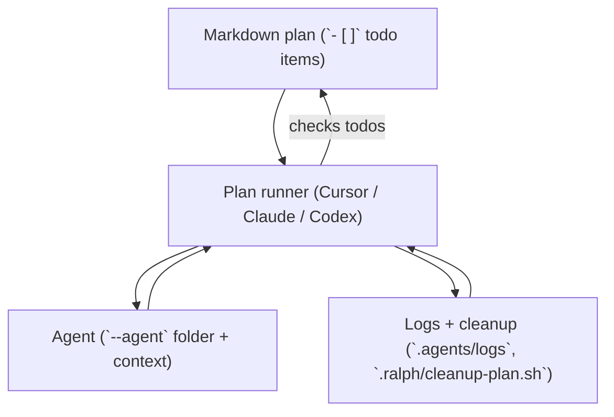

# Ralph

**Ralph** is a plan-driven agent workflow kit for **Cursor**, **Claude Code**, and **OpenAI Codex**. One markdown plan with `- [ ]` / `- [x]` checklists; runners loop until the plan is done. A shared **orchestrator** runs multi-stage pipelines across any mix of those runtimes.

Install this repo into your project and get the same scripts we use in production.

## What you get

| Path | Purpose |
|------|---------|
| `.ralph/` | Orchestrator (`orchestrator.sh`), cleanup, `plan.template`, `new-agent.sh`, orchestration templates |
| `.cursor/ralph/` | Cursor CLI plan loop, templates, model selection, agent-config helper |
| `.claude/ralph/` | Claude headless plan loop + templates |
| `.codex/ralph/` | Codex `exec` plan loop + templates |
| `ralph-dashboard/` | Optional local UI for plans, artifacts, and logs (same path in this repo and after install) |

Logs and artifacts typically land under `.agents/logs/` and `.agents/artifacts/` (see each runner README under `bundle/`).

**`repo-context`** is a generic template: edit each runtime's `skills/repo-context/SKILL.md` with your layout, stack, and commands (or merge into one shared path if you prefer).

## Install into your repository

### Option A: Git submodule (easy updates)

```bash
cd /path/to/your-repo
git submodule add <YOUR_RALPH_REPO_URL> vendor/ralph
git submodule update --init
./vendor/ralph/install.sh
git add .ralph ralph-dashboard \
  .cursor/ralph .cursor/rules .cursor/skills .cursor/agents/ralph-starter \
  .claude/ralph .claude/rules .claude/skills .claude/agents/ralph-starter \
  .codex/ralph .codex/rules .codex/skills .codex/agents/ralph-starter
git commit -m "Add Ralph agent workflows"
```

Teammates after clone:

```bash
git submodule update --init
./vendor/ralph/install.sh   # re-sync if bundle changed
```

### Option B: One-time copy

```bash
git clone <YOUR_RALPH_REPO_URL> /tmp/ralph
/tmp/ralph/install.sh /path/to/your-repo
rm -rf /tmp/ralph
```

### Option C: Subtree (vendored history)

```bash
git subtree add --prefix vendor/ralph https://github.com/you/ralph.git main --squash
./vendor/ralph/install.sh
```

### Install flags

```text
./install.sh                  # everything (recommended)
./install.sh --cursor         # ralph runner + Cursor rules/skills/agents
./install.sh --codex --claude # Codex & Claude runtimes only, skip Cursor pieces
./install.sh --dry-run .      # print actions only
./install.sh --no-dashboard   # skip ralph-dashboard/ (everything else unchanged)
```

Omit the runtime flags to install the entire bundle. Provide one or more of
`--cursor`, `--claude`, `--codex`, or `--shared` when you only want to copy
those directories and avoid consuming the rest of `bundle/`. By default, the
installer also copies this repo's `ralph-dashboard/` into your project
(Python stdlib only; no Node). Use `--no-dashboard` to skip.

**Note:** Codex and Claude runners expect **`.cursor/ralph/agent-config-tool.sh`** when using `--agent` with prebuilt agents. Install **at least** `.cursor/ralph` alongside them, or use full `./install.sh`.

Requires **bash** and **rsync** (standard on macOS/Linux).

## After install

1. **Plan file** &mdash; start from `.ralph/plan.template` or set `"plan"` in each `plan-runner.json`.
2. **CLIs** &mdash; [Cursor CLI](https://cursor.com/docs/cli/installation), `claude` (Claude Code), or `codex` as needed.
3. **Prebuilt agents** &mdash; The bundle includes **`ralph-starter`** (minimal) plus role agents aligned with multi-stage workflows: **`research`**, **`architect`**, **`implementation`**, **`code-review`**, **`qa`**, and **`security`** (under `.cursor/agents`, `.claude/agents`, and `.codex/agents` where each runtime ships configs). Use `--agent <name>` with `run-plan.sh` or orchestration JSON. Run `bash .ralph/new-agent.sh` to add more.

### Ralph dashboard

**`ralph-dashboard/`** lives at your repo root (here and in projects that run `install.sh`). The UI reads `.agents/orchestration-plans`, `.agents/artifacts`, and `.agents/logs` relative to the repo root (the parent of `ralph-dashboard/`).

From the project root:

```bash
python3 ralph-dashboard/server.py
```

Open **http://127.0.0.1:8123** (defaults; use `--host` / `--port` to change). Requires Python 3 only.

## Workflow overview



The runner repeatedly pulls the next unchecked checkbox, summarizes progress in the logs, and optionally hands the prompt to a configured agent before looping until every `- [ ]` becomes `- [x]`. You can find the full checklist-to-loop logic (and supporting scripts) in [`docs/AGENT-WORKFLOW.md`](docs/AGENT-WORKFLOW.md).

### Prepare a plan

1. Copy the template, fill in TODOs, and explain the desired outcome plus any validation commands (lint/test steps, artifact reviewers, manual verifications):

   ```bash
   cp .ralph/plan.template PLAN.md
   ```

2. Use assets like `.agents/artifacts/README.md` to describe required sections for research, architecture, implementation, QA, or security handoffs.

3. If you need a research → implementation → review pipeline, break the work into stage plans (`.agents/orchestration-plans/*.plan.md`) and declare them in a JSON `.orch.json` using `.ralph/orchestration.template.json`.

### Run a single-agent plan

1. Choose a runtime:

   - **Cursor**: `.cursor/ralph/run-plan.sh --plan PLAN.md --agent ralph-starter`
   - **Claude**: `.claude/ralph/run-plan.sh --plan PLAN.md --agent ralph-starter`
   - **Codex**: `.codex/ralph/run-plan.sh --plan PLAN.md --agent ralph-starter --non-interactive`

2. Override defaults with `--plan`, `--agent`, `--select-agent`, and `--model` flags supported by each runtime. Cursor’s runner accepts `CURSOR_PLAN_MODEL`, Claude reads `CLAUDE_PLAN_MODEL`, and Codex reads `CODEX_PLAN_MODEL`.
3. If an agent writes `pending-human.txt` (Cursor) or `HUMAN-INPUT-REQUIRED.md` (deferred mode), provide the answer and rerun the same command so the runner resumes from the first unchecked todo.

4. After each run, inspect:
   - `.agents/logs/plan-runner-*.log` for stdout/stderr across runtimes
   - `.agents/artifacts/{{ARTIFACT_NS}}/` for research/architecture/implementation handoffs
   - `.ralph/cleanup-plan.sh <namespace>` if you need to wipe logs/artifacts before reruns

### Orchestrate multiple agents

Use `.ralph/orchestrator.sh` with a JSON spec containing stages, runtimes, agents, and artifact contracts:

```bash
.ralph/orchestrator.sh --orchestration .agents/orchestration-plans/my-feature.orch.json
```

Each stage can run Cursor, Claude, or Codex independently; the orchestrator enforces artifact existence/non-empty values before advancing. Review the walkthrough and artifacts schema in [`docs/AGENT-WORKFLOW.md`](docs/AGENT-WORKFLOW.md), especially sections on stage plans, `loopControl`, and feedback loops. For guided examples (full worker run and a multi-stage orchestrated pipeline), see [`docs/worker-ralph-example.md`](docs/worker-ralph-example.md) and [`docs/orchestrated-ralph-example.md`](docs/orchestrated-ralph-example.md).

### Runtime and agent references

- [`docs/worker-ralph-example.md`](docs/worker-ralph-example.md) — guided walk-through covering one-worker plan life cycle, runner usage, and log/artifact inspections.
- [`docs/orchestrated-ralph-example.md`](docs/orchestrated-ralph-example.md) — multi-stage example showing plan prep, JSON spec, orchestrator run, and artifact verification.

## Documentation in the bundle

- **[docs/AGENT-WORKFLOW.md](docs/AGENT-WORKFLOW.md)** &mdash; plan loop, orchestrator, new-agent, cleanup  
- `.cursor/ralph/README.md` &mdash; Cursor runner internals and portability notes  
- `.codex/ralph/README.md` &mdash; Codex runner and env  
- Per-runtime `run-plan.sh --help` where supported  

For orchestration JSON shape, read the header of `.ralph/orchestrator.sh` and `.ralph/orchestration.template.json`.

## License

MIT &mdash; see [LICENSE](LICENSE).
