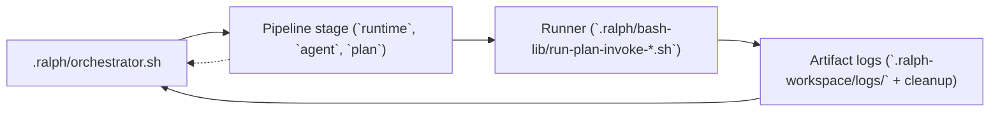

# Ralph agent workflow (quick reference)

## Plan-first loop

1. Use `ralph create plan` to scaffold a single plan. `--format classic` creates the zero-dependency markdown checklist path; `--format yaml` creates the flat YAML-frontmatter TODO queue. For a staged multi-agent pipeline, use `ralph create orc`.
2. Write tasks with the expected syntax for the chosen format: classic uses markdown checkboxes (`- [ ]` todo, `- [x]` done); yaml uses frontmatter TODOs; orchestration uses stage TODOs plus artifacts.
3. Open tasks in classic plans must use that exact `- [ ]` form (space inside the brackets). `- []` is not a task line and is ignored by the runners.
4. Run a runner until all items are checked:

   - Cursor: `.ralph/run-plan.sh --runtime cursor --plan PLAN.md`
   - Claude: `.ralph/run-plan.sh --runtime claude --plan ...`
   - Codex: `.ralph/run-plan.sh --runtime codex --non-interactive --plan ...`
   - OpenCode: `.ralph/run-plan.sh --runtime opencode --plan ...`
   - Antigravity: `.ralph/run-plan.sh --runtime antigravity --plan ...`
   - Antigravity: `.ralph/run-plan.sh --runtime antigravity --plan ...` (models from `agy models`; passed to `agy --model "<exact model string from agy models>"`)

**Three-root model:** Ralph separates the **project root** (folder with `.ralph/` and project-relative plans), the **state root** (directory containing `.ralph-workspace/` logs, artifacts, and sessions; default `<project>/.ralph-workspace`, overridable via `--workspace-root` or `RALPH_PLAN_WORKSPACE_ROOT`), and the **agent workspace** (sandboxed work tree for model file access; default: the directory that invoked `run-plan.sh`, overridable via `--agent-workspace` or `RALPH_AGENT_WORKSPACE`). Most plan and doc paths resolve against the project root; paths under `.ralph-workspace/` resolve against the state root. YAML-format runs still write the normal plan-runner logs under `.ralph-workspace/logs/` and artifacts under `.ralph-workspace/artifacts/`. See [AGENTS.md](../AGENTS.md#three-root-model) for defaults, compatibility, and examples.

3. With **`--agent <id>`**, the runner loads that id under `.cursor/agents/`, `.claude/agents/`, `.codex/agents/`, `.opencode/agents/`, or Ralph's Antigravity metadata under `.agents/agents/`. Try **`architect`** or **`research`** after install. Native Antigravity personas are also listed in `.agents/agents.md`. The **agent-config-tool** under `.ralph/` validates and builds context for all runtimes.

## Multi-stage orchestration

1. Use `ralph create orc` (interactive wizard) to scaffold a staged workflow. It outputs a yaml `.plan.md` with a `pipeline:` block. Each stage carries inline content or delegates to a separate plan via `planFile:`.
2. Each stage declares its `runtime` (`cursor` | `claude` | `codex` | `opencode` | `antigravity`), `agent`, and either inline todos or a `planFile`.
3. Run: `ralph run --plan path/to/pipeline.plan.md`. The orchestration plan is auto-detected and dispatched to `orchestrator.sh`.

### Routing and validation

TODOs route by `runtime`, `agent`, and optional `model`. Stage routing follows the same three fields plus stage artifacts. Validation has two cases: if the selected runtime has a configured model, Ralph uses that model; if the runtime config leaves model empty, Ralph falls back to the command-line/default model source for that runtime. The orchestrator rejects stages when required artifacts are missing or empty, and the runner rejects TODOs that do not satisfy the current format's required metadata.

Pipeline orchestration shares context with explicit artifact declarations. Use `produces` and `requires` artifact declarations, plus explicit artifact paths in TODO content, so required inputs are surfaced in the prompt automatically.

## Visual flow



Each stage drives the unified plan runner, which in turn writes logs and cleaned-up artifacts before the orchestrator advances to the next stage in the JSON pipeline or the pipeline execution flow.

### Using the runners

1. **Create plans** with `ralph create plan` (`--format classic` for the zero-dependency checklist, `--format yaml` for the flat YAML TODO queue) or `ralph create orc` for staged workflows. YAML and orchestration plans require `python3`; classic plans do not.
2. **Install the vendor CLI** you use (Cursor agent, `claude`, `codex`, `opencode`, or `agy`) so the runner can invoke it. Then run:
   - **`.ralph/run-plan.sh --runtime cursor|claude|codex|opencode|antigravity --plan <path>`** -- the single plan runner (**`--plan` is required**). Each runtime has its own env prefix (`CURSOR_PLAN_*`, `CLAUDE_PLAN_*`, `CODEX_PLAN_*`, `OPENCODE_PLAN_*`, `ANTIGRAVITY_PLAN_*`) and supports the same optional flags (`--agent`, `--select-agent`, `--non-interactive`, `--model`, etc.). Antigravity model ids come from `agy models` and are passed unchanged to `agy --model "<exact model string from agy models>"`.
3. **Handle human input**: The runner follows an **interactive-first flow**: TTY-attached runs prompt inline on `/dev/tty` and continue in the same process (multiline answers may include blank lines; end input with a line containing only `.`). When stdin/stdout are not a TTY (for example under the orchestrator), `.ralph/run-plan.sh` still **pauses in-process**: under **`.ralph-workspace/sessions/<RALPH_PLAN_KEY>/`** it writes `pending-human.txt`, `HUMAN-INPUT-REQUIRED.md`, and a placeholder `operator-response.txt`, then polls until you save a real answer (override poll interval with `RALPH_HUMAN_POLL_INTERVAL`). Optional escalation via `RALPH_HUMAN_ACK_TOOL` can run first for bridges (the orchestrator script itself does not expose `--human-ack`). Set `RALPH_HUMAN_OFFLINE_EXIT=1` only if you need the old behavior (exit 4 and restart after editing files).

   Every human exchange (question + answer) is also appended to **`human-replies.md`** in that session directory, giving you a namespace-scoped audit trail to review what was asked, who answered it, and what needs to be replayed before resuming the plan.
4. **Logs and artifacts**: After each run, inspect `.ralph-workspace/logs/<namespace>/plan-runner-*.log` for stdout and error details, and `.ralph-workspace/artifacts/{{ARTIFACT_NS}}/` for generated docs. YAML-format runs use the same normal plan-runner logs. Use `.ralph/cleanup-plan.sh <namespace>` to wipe logs, session files, and artifacts before a fresh run.
5. **Subagents and teams**: The vendor docs for Cursor, Claude, Codex, OpenCode, and Antigravity explain subagents and multi-agent flows; use those when you split work inside a plan or a stage. For Claude Code **agent teams** specifically (teammates, handoffs, teams vs orchestrator), see [Claude Code agent teams with Ralph](CLAUDE-AGENT-TEAMS.md).

### Claude headless stalls on permission or new files

Claude Code in `-p` mode only auto-approves tools in `--allowedTools`. New files use the **Write** tool; **Edit** is for existing files. The Ralph Claude runner defaults to `Bash,Read,Edit,Write`. If you set `CLAUDE_PLAN_ALLOWED_TOOLS` without **Write**, creating artifacts (e.g. `code-review.md`) can hang. See [Claude headless / auto-approve tools](https://code.claude.com/docs/en/headless).

### Helpful references

- Ralph runner internals: `.ralph/bash-lib/README.md`
- Cursor subagent architecture: [https://cursor.com/docs/subagents](https://cursor.com/docs/subagents)
- Claude subagents doc: [https://docs.anthropic.com/en/docs/claude-code/subagents](https://docs.anthropic.com/en/docs/claude-code/subagents)
- Claude agent teams: [https://code.claude.com/docs/en/agent-teams](https://code.claude.com/docs/en/agent-teams); using them with Ralph: [CLAUDE-AGENT-TEAMS.md](CLAUDE-AGENT-TEAMS.md)
- Codex subagent concepts: [https://developers.openai.com/codex/concepts/subagents](https://developers.openai.com/codex/concepts/subagents)
- Codex multi-agent guide: [https://developers.openai.com/codex/multi-agent](https://developers.openai.com/codex/multi-agent)
- Worker example walkthrough: [worker-ralph-example.md](worker-ralph-example.md)
- Orchestrated example walkthrough: [orchestrated-ralph-example.md](orchestrated-ralph-example.md)

### Sample prompts & templates

Use the prompts below to build yaml plans that are ready for the plan runners:

**Worker plan prompt**

```
I need a worker plan for [TASK]. Start with `.ralph/plan-templates/classic.plan.template.md` and save the output as `PLAN.md`.

Break the task into discrete TODOs (`- [ ]`). For each item, mention the files to touch, commands to run for validation (lint/tests), and any artifact that should result (research notes, documentation, QA checklist). The plan should be explicit enough that the runner can check `- [x]` once the change is complete.
```

**Stage plan prompt for orchestrations**

```text
Create three stage plans (research, architecture, implementation)
using `.ralph/plan-templates/classic.plan.template.md`.

Save each plan under `.ralph-workspace/orchestration-plans/<namespace>/`:
- `<namespace>-01-research.plan.md`
- `<namespace>-02-architecture.plan.md`
- `<namespace>-03-implementation.plan.md`

Include:
- Research tasks that explore modules/files, gather questions, and capture findings in `.ralph-workspace/artifacts/{{ARTIFACT_NS}}/research.md`.
- Architecture tasks that produce design docs, interfaces, and artifact handoffs like `.ralph-workspace/artifacts/{{ARTIFACT_NS}}/architecture.md`.
- Implementation tasks that list files/commands, include verification steps (`npm run lint`, `npm run test`), and mention QA or rollback notes.
```

**Orchestration spec prompt**

```text
I am coordinating [FEATURE] across Cursor, Claude, and Codex.
Each stage plan already exists under
`.ralph-workspace/orchestration-plans/<namespace>/`.

Produce a pipeline plan at `.ralph-workspace/orchestration-plans/<namespace>/<namespace>.plan.md`
that:
- wires those stage plans together using a `pipeline:` block,
- assigns a runtime and agent for each stage,
- lists required artifact files (research.md, architecture.md,
  implementation-handoff.md, etc.).

If a reviewer should send work back to an earlier stage,
include `loopControl`.
```

### Orchestration JSON example

```json
{
  "name": "my-feature-pipeline",
  "namespace": "my-feature",
  "description": "Multi-stage pipeline for notifications work.",
  "stages": [
    {
      "id": "research",
      "runtime": "cursor",
      "agent": "research",
      "plan": ".ralph-workspace/orchestration-plans/my-feature/my-feature-01-research.plan.md",
      "artifacts": [
        {
          "path": ".ralph-workspace/artifacts/{{ARTIFACT_NS}}/research.md",
          "required": true
        }
      ]
    },
    {
      "id": "implementation",
      "runtime": "claude",
      "agent": "implementation",
      "plan": ".ralph-workspace/orchestration-plans/my-feature/my-feature-02-implementation.plan.md",
      "inputArtifacts": [
        {
          "path": ".ralph-workspace/artifacts/{{ARTIFACT_NS}}/research.md"
        }
      ],
      "artifacts": [
        {
          "path": ".ralph-workspace/artifacts/{{ARTIFACT_NS}}/implementation-handoff.md",
          "required": true
        }
      ]
    },
    {
      "id": "code-review",
      "runtime": "codex",
      "agent": "code-review",
      "plan": ".ralph-workspace/orchestration-plans/my-feature/my-feature-03-code-review.plan.md",
      "inputArtifacts": [
        {
          "path": ".ralph-workspace/artifacts/{{ARTIFACT_NS}}/implementation-handoff.md"
        }
      ],
      "artifacts": [
        {
          "path": ".ralph-workspace/artifacts/{{ARTIFACT_NS}}/code-review.md",
          "required": true
        }
      ],
      "loopControl": {
        "loopBackTo": "implementation",
        "maxIterations": 2
      }
    }
  ]
}
```

## New prebuilt agent

From your project root (where `.ralph/` lives):

```bash
bash .ralph/new-agent.sh
```

Scaffolds agent folders under `.cursor/agents/`, `.claude/agents/`, `.codex/agents/`, `.opencode/agents/`, and Ralph's Antigravity metadata under `.agents/agents/` when those CLIs exist. For Antigravity it also creates or updates the native `.agents/agents.md` registry. Non-interactive: `bash .ralph/new-agent.sh --non-interactive` with `CURSOR_PLAN_MODEL` (and `CLAUDE_PLAN_MODEL` / `CODEX_PLAN_MODEL` or saved models via `ralph models add claude|codex <id>` when agent config `model` is empty). For Antigravity, set `ANTIGRAVITY_PLAN_MODEL` to an exact display string from `agy models` so Ralph can pass it to `agy --model "<exact model string from agy models>"` unchanged.

## Cleanup

After a run you can: `.ralph/cleanup-plan.sh <artifact-namespace>` to purge logs and artifacts.
