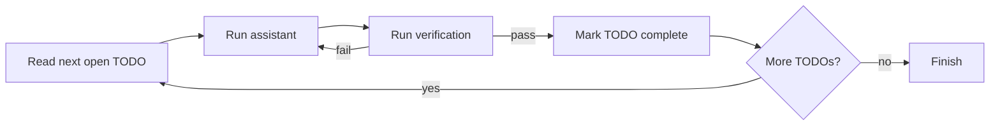

# Leaf plans

A leaf plan is Ralph's direct path for work that is already understood. It is a
checklist with durable progress: Ralph selects the next open TODO, starts the
chosen runtime, verifies the result, updates the control plan, and repeats.

Use a [workflow](WORKFLOWS.md) when the request still needs investigation or
planning, or when delivery needs separate review, approval, integration, or QA.

## Create a plan

```bash
ralph create plan --format classic
```

Classic plans are ordinary Markdown. Keep each TODO independently achievable and
put its verification beside it:

```markdown
# CSV export

- [ ] Add the export endpoint in `src/export.ts`.
  Verify: `npm test -- export`
- [ ] Document the endpoint in `docs/api.md`.
  Verify: `rg -n "CSV export" docs/api.md`
```

Open tasks must use `- [ ]`; completed tasks use `- [x]`. Ralph ignores `- []`.
YAML plans are also supported with `ralph create plan --format yaml`.

For a YAML leaf plan, choose either a ready-to-edit template or guided routing
setup:

```bash
# Manual: create the editable template (the default behavior)
ralph create plan --format yaml --manual

# Guided: choose plan-level runtime, model, and session strategy
ralph create plan --format yaml --guided

# Scripted equivalent
ralph create plan --format yaml --runtime codex --model gpt-5 \
  --session-strategy compact
```

The guided and scripted settings become YAML plan defaults. Individual TODOs
can override `runtime`, `model`, `sessionStrategy`, and `contextBudget`; a
TODO that switches runtime must use `sessionStrategy: fresh`.

## Run it

```bash
ralph run --plan PLAN.md
```

The underlying development entry point is equivalent:

```bash
.ralph/run-plan.sh --runtime codex --plan PLAN.md
```

`--plan` is always required. Positional plan or workspace paths are rejected.
Use `--runtime` and `--model` to override routing for a run.

## What happens in the loop



The plan file is the control surface. The runtime agent may use native
subagents or teams, but the parent session still owns the TODO, verification,
artifacts, and completion decision.

## Sessions and human input

Fresh sessions are the default: each distinct TODO gets a clean context. Use a
session strategy when later TODOs benefit from continuity:

| Strategy | Behavior |
| --- | --- |
| `fresh` | New assistant session for each TODO |
| `resume` | Reuse the same session and its full context |
| `reset` | Reuse the session ID and inject the runtime's reset command |
| `compact` | Reuse the session ID and inject the runtime's compact command |

```bash
ralph run --plan PLAN.md --session-strategy resume
ralph run --plan PLAN.md --cli-resume
```

For a durable default in a YAML leaf plan, set `sessionStrategy` in the plan
header. A TODO may override it when one item needs isolation:

```yaml
---
runtime: codex
sessionStrategy: compact
todos:
  - id: inspect
    content: Inspect the current behavior and record the baseline.
    verification: test -s .ralph-workspace/artifacts/{{ARTIFACT_NS}}/baseline.md
    sessionStrategy: fresh
---
```

Use `resume` for a short sequence that benefits from carrying its immediate
handoff forward. Use `compact` for a long implementation sequence that needs
continuity without letting its context grow indefinitely. Keep `fresh` for
independent review, QA, security, or any TODO that must not inherit prior work.

TTY runs ask questions inline. A headless run persists pending input under
`.ralph-workspace/sessions/<plan-key>/` and waits for an operator response.
Human exchanges are appended to `human-replies.md` in that directory. See
[Environment](ENVIRONMENT.md) for polling, offline-exit, and resume controls.

## Long-running commands

Prefer a TODO's strict verification command for builds and tests. Background
continuation is opt-in with `RALPH_BG_JOBS=1`; when enabled, start work with
`.ralph/ralph-bg.sh '<command>'` and let Ralph resume the same TODO when the job
finishes. Do not build polling loops into prompts or plans.

## Outputs and cleanup

| Output | Location |
| --- | --- |
| Combined run logs | `.ralph-workspace/logs/<plan-key>/` |
| Declared artifacts | `.ralph-workspace/artifacts/<artifact-namespace>/` |
| Session state | `.ralph-workspace/sessions/<plan-key>/` |

To remove the state for a known namespace before an intentional fresh run:

```bash
.ralph/cleanup-plan.sh <namespace>
```

Cleanup removes logs, artifacts, and session state for that namespace, so use it
only when you do not need resume history.

## Hand a plan to a delivery workflow

If the checklist is ready but should pass through isolated implementation,
review, integration, and independent QA, supply it to `plan-delivery`:

```bash
ralph workflow start plan-delivery --plan PLAN.md
```

The workflow freezes the supplied bytes and executes a mutable control copy.
Changing the source after start does not change the run. See
[Plans inside workflows](WORKFLOWS.md#plans-inside-workflows).
