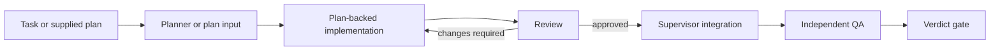

# Workflows

A workflow is a reusable development process. It can investigate a request,
generate a plan, execute that plan in an isolated workspace, review the change,
publish an approved changeset, and run independent QA. Ralph records every stage
under one durable run ID.

Use a [leaf plan](AGENT-WORKFLOW.md) when you already have a small checklist and
do not need those boundaries.

## Start a workflow

Give a task to a task-based workflow:

```bash
ralph workflow list
ralph workflow show feature-delivery
ralph workflow inspect feature-delivery
ralph workflow start feature-delivery --task "Add CSV export"
```

Or give an existing checklist to a workflow that declares `planInput`:

```bash
ralph workflow start plan-delivery --plan ./PLAN.md
```

`--plan` also accepts a requirements document with no Ralph TODOs. In that case,
its content becomes the task text. A file containing `- [ ]` TODOs is treated as
a leaf plan and requires a workflow with `planInput`.

Noninteractive starts require `--yes`. A TTY start normally attaches the live
viewer; press `q` to detach without cancelling.

## Pick the smallest useful workflow

Bundled workflows are starting points, not mandatory ceremony:

| Workflow | Use it for |
| --- | --- |
| `feature-delivery` | Investigate, plan, implement, review, integrate, and verify a feature |
| `bug-fix` | Reproduce and repair a defect with review and QA |
| `refactor` | Preserve behavior while changing structure |
| `plan-delivery` | Execute an existing leaf plan under review and QA |
| `human-verified-delivery` | Add explicit plan and result approvals to delivery |
| `investigation` | Answer a question and produce a next-step plan without changing code |
| `triage` | Shape an unclear request and recommend the next workflow |
| `assessment` | Run parallel read-only correctness, security, performance, and compatibility reviews |
| `review-jury` | Ask three runtimes to vote on existing work |
| `release-gate` | Verify a release candidate without publishing it |

Run `ralph workflow show <id>` for the current definition. Project or global
customizations can change a bundled shape, so the installed file is the source
of truth.

## How a run fits together



Ordinary stages are attributable assistant runs. Supervisor nodes perform
model-free control work such as joining branches, checking a verdict, requesting
approval, or integrating a changeset. Required artifacts connect the stages and
give the supervisor evidence it can verify.

Runtime-native subagents remain inside an ordinary stage. They do not replace a
workflow stage or satisfy its plan TODOs. The parent runtime agent remains
responsible for the stage's writes, verification, and artifacts.

## Sequential and Dependency modes

Both modes use the same public lifecycle commands and durable run registry.

| | Sequential | Dependency |
| --- | --- | --- |
| Shape | Ordered stages and parallel waves | Explicit dependency graph |
| Best fit | Straightforward internal pipelines | Isolated delivery, fan-out review, rework, gates, and integration |
| Workspace behavior | Runs stage plans through classic orchestration internals | Can create candidate snapshots and capture scoped changesets |
| Supervisor nodes | Limited | `integrate`, `join`, `gate`, `approval`, and related nodes |

Author new definitions with `mode: sequential` or `mode: dependency`. Names such
as graph, orchestration, checkpoint, and `humanAck` remain only in internal or
legacy compatibility surfaces.

### Optional containerized verification (`execImage`)

Compiled Dependency graph nodes may set optional `execImage` (and
`execWorkspaceWrite`) so only the node's declared verification command runs in
Docker. Without `execImage`, verification stays on the host and dispatch stays
byte-equivalent to current behavior.

Host-to-container workspace mapping:

| Host path | Container path | Notes |
| --- | --- | --- |
| Node workspace directory | `/ralph/workspace` | Sole bind mount; `--workdir` is `/ralph/workspace` |
| (none) | — | Runtime credential dirs (`~/.cursor`, `~/.claude`, `~/.codex`, `~/.opencode`, `~/.agents`) and Ralph/agent trees are never mounted |

`execWorkspaceWrite` defaults to `readonly` (`:ro` mount). `writable` opts into a
writable mount; containers still run as `$(id -u):$(id -g)` so host ownership is
preserved. Schema and dispatch details live in
`bundle/.ralph/schemas/graph.schema.json` and
`bundle/.ralph/bash-lib/graph/graph-dispatch.sh`.

## Follow a run

Every start prints an exact run ID. Keep it; public lifecycle commands refuse
`latest` and internal namespace or node selectors.

```bash
ralph workflow runs
ralph workflow status <run-id>
ralph workflow watch <run-id>
ralph workflow logs <run-id>
```

Use `status` for one snapshot and `watch` for a live view. Redirected output, or
`watch --plain`, uses a stable plain renderer. `ralph workflow runs --tsv` and
`--json` are useful for scripts.

Common states:

| State | Meaning | Next step |
| --- | --- | --- |
| running | The supervisor or a stage is active | Watch or detach |
| waiting | Ralph persisted an approval or input request | List actions, respond, then resume |
| blocked | Human changes or recovery are required | Follow the exact reset or recover command |
| failed | Validation, runtime, verification, or rework failed | Inspect status, logs, handoff, and artifacts |
| completed | All required stages and gates passed | Review the final artifacts |
| cancelled | The operator cancelled the run | Start a new run if the work is still needed |

An exit code of `3` means Ralph successfully persisted a wait. It is not a failed
run. Exit `1` is a validation, runtime, or verification failure; exit `2` is bad
or retired CLI usage.

## Approvals and operator input

Outstanding actions are files in the run registry, bound to the run, stage, and
attempt that created them:

```bash
ralph workflow actions list <run-id>
ralph workflow actions respond <run-id> <request-id> \
  --decision approve --yes
ralph workflow resume <run-id>
```

Approval decisions are `approve`, `request-changes`, or `cancel`. Agent questions
use `--decision answer --message "..."`. An answer is injected once into the same
TODO's next fresh invocation and then marked consumed.

If an approval returns `request-changes`, status names the one permitted
`changesTarget`. Reset that stage, preserving the human feedback, and resume:

```bash
ralph workflow reset <run-id> --stage <changes-target> --yes
ralph workflow resume <run-id>
```

Assistant prose cannot approve a gate or answer a request.

## Plans inside workflows

Planner output and operator-supplied plans are immutable inputs. Ralph copies and
hashes them under the registry run. A plan-backed consumer gets a separate
mutable control copy whose checkboxes record execution progress.

This distinction matters during resume and rework:

- Resume continues the same control copy.
- Review rework starts a fresh control copy from the same immutable source and
  includes the prior verdict.
- Editing the original supplied plan does not change a running workflow.
- To run changed source bytes, start a new workflow run.

## Review and rework

Evaluator stages should write `findings` with a stable `id`, `severity`,
`summary`, `evidence`, `requiredFix`, `verification`, and `disposition`. Ralph
accumulates them in `defect-ledger.json`.

A blocking finding stays open until a later verdict repeats its ID with
`disposition: fixed` or `wontfix`. An evaluator cannot approve while a blocking
finding remains open. If the same finding survives the configured number of
rounds, the run fails with `rework-stalled` instead of consuming the rest of the
rework budget.

Delivery workflows finish with a model-free verdict gate. A QA handoff is useful
to humans; the schema-valid verdict is what decides success.

## Author a workflow

Scaffold one of the two public modes:

```bash
ralph create workflow --mode dependency
ralph create workflow --mode sequential
```

This small Dependency example investigates a task and then runs a gate:

```yaml
---
name: focused-investigation
overview: Investigate a question and verify that the report exists.
kind: workflow
mode: dependency
pipeline:
  verificationProfiles:
    - name: report-ready
      steps:
        - name: report-exists
          command: test -s .ralph-workspace/artifacts/{{ARTIFACT_NS}}/report.md
          timeout: 30
  stages:
    - id: investigate
      sessionStrategy: resume
      instructions: |
        Investigate {{TASK}} without changing product code. Write a concise,
        evidence-backed report to
        .ralph-workspace/artifacts/{{ARTIFACT_NS}}/report.md.
      produces:
        - path: .ralph-workspace/artifacts/{{ARTIFACT_NS}}/report.md
          required: true
    - id: report-gate
      type: gate
      profile: report-ready
      dependsOn:
        - investigate
      requires:
        - path: .ralph-workspace/artifacts/{{ARTIFACT_NS}}/report.md
          required: true
todos:
  - id: investigate-task
    stage: investigate
    content: Investigate {{TASK}} and write the required report.
    verification: Confirm the report exists and cites repository evidence.
    status: pending
  - id: verify-report
    stage: report-gate
    content: Run the report-ready verification profile.
    verification: Confirm the profile passes.
    status: pending
---
```

Validate before starting:

```bash
ralph workflow inspect --file ./focused-investigation.workflow.md
ralph workflow start --file ./focused-investigation.workflow.md \
  --task "Why are export jobs timing out?"
```

### Ordinary stage fields

| Field | Purpose |
| --- | --- |
| `id` | Stable lowercase, hyphenated stage ID |
| `instructions` | Non-empty guidance for the runtime agent |
| `dependsOn` | Stages that must finish first |
| `runtime`, `model` | Optional routing override |
| `sessionStrategy` | `fresh`, `resume`, `reset`, or `compact` between the stage's distinct TODOs |
| `requires`, `produces` | Artifact inputs and outputs |
| `planner` | Make the stage produce a validated plan file |
| `planFrom` | Execute a plan produced by another stage |
| `workspaceMode`, `writeScopes` | Candidate workspace and mutation boundary |

Use `planInput.stage` at the workflow root when one stage accepts an
operator-supplied leaf plan. `{{TASK}}`, `{{INPUT_PLAN}}`, `{{ARTIFACT_NS}}`,
`{{PLAN_KEY}}`, and `{{STAGE_ID}}` are resolved by Ralph where their contracts
allow them.

Supervisor nodes reject `instructions`, TODO work, runtime/model routing, and
mutation scopes. Their behavior must remain model-free.

### Session strategy by stage

Set `sessionStrategy` directly on an ordinary stage. It is inherited by the
stage's TODOs and can be overridden by a TODO in a YAML plan. `fresh` is the
default. `resume` retains full context across a small, cohesive stage; `compact`
retains continuity while compacting before each new TODO, which suits long plan
execution; `reset` retains the session identity but starts each TODO with the
runtime reset prompt.

Use `fresh` for independent reviewers, QA, security, graders, and runtime
switches. Grader stages require `fresh`, and consensus voters are always forced
to `fresh` to preserve independence. The bundled workflows explicitly use
`resume` for short investigation, planning, and synthesis stages; `compact` for
long implementation plans; and `fresh` for implementation review and QA.
The dashboard workflow editor exposes this selector alongside runtime and model
for every ordinary stage.

### Shared instructions

Reusable stage guidance belongs in a bundled fragment:

```text
{{INCLUDE:evidence-citation}}
```

Fragments live under `.ralph/workflows/_fragments/`. A fragment name is a bare
slug and fragments cannot include other fragments.

## Runtime and model routing

Routing resolves from the most specific valid setting: stage, workflow default,
start-time override, runtime environment/default, then interactive selection
where available. `ralph workflow inspect <id>` shows the resolved shape before a
run is created.

Interactive start may offer to persist routing. Scripts can update routing with
an optimistic concurrency hash:

```bash
ralph workflow routing set <id> --project --sha256 <hex> \
  --default-runtime codex --default-model <model-id>
```

Only project and global definitions are writable. Bundled definitions must be
customized first.

## Resolution and customization

An unscoped workflow lookup resolves in this order:

```text
project -> global -> bundled
```

Use `ralph workflow list --all-scopes` to see shadowed definitions. Scoped
`show`, `path`, edit, delete, and routing operations address exactly one layer
and never fall through.

```bash
# Create or edit a project override, seeded from the current winner
ralph workflow edit feature-delivery --project

# Create or edit a reusable global override
ralph workflow edit feature-delivery --global
```

Saves replace the complete workflow file after validation. Dashboard and routing
writes require the SHA-256 of the bytes that were loaded; a mismatch forces a
reload instead of overwriting concurrent work. Deleting an override reveals the
next definition in the resolution chain.

## Dashboard

The dashboard Workflows area uses the same project, global, and bundled model.
Bundled definitions offer **Customize for this project** and **Customize
globally**. Project mutations and starts require a selected project; global
customization remains available from the all-projects view.

The structured editor supports the common authoring subset. Complex definitions
open in raw mode, while runtime and model routing remain editable through the
safe routing API. See [the dashboard guide](../ralph-dashboard/README.md) for
development commands and write-guard details.

## Recovery commands

Use the action Ralph reports rather than editing registry files:

| Situation | Command |
| --- | --- |
| Pending approval or question | `ralph workflow actions list <run-id>` |
| Continue after a persisted wait | `ralph workflow resume <run-id>` |
| Human requested changes | `ralph workflow reset <run-id> --stage <changes-target>` |
| Proven stale supervisor owner | `ralph workflow recover <run-id>` |
| Stop a live or nonterminal run | `ralph workflow cancel <run-id>` |
| Salvage a failed task | `ralph workflow handoff <run-id>` |

Registry state, immutable inputs, control plans, decisions, and ledger records
are supervisor data. Do not repair a run by rewriting those files directly.
