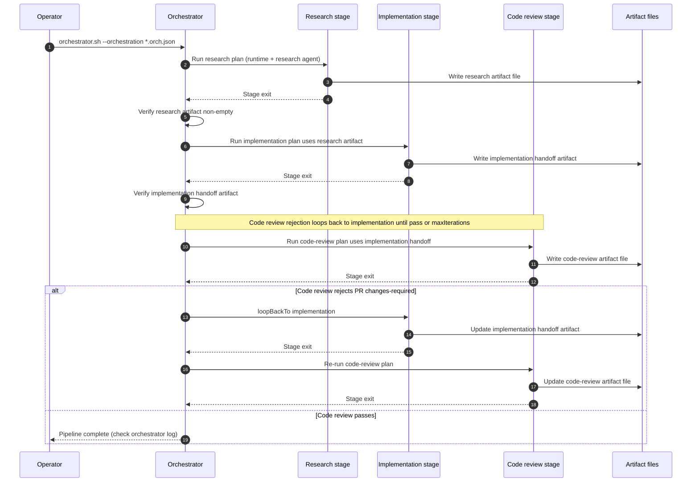

<!--- Example documenting orchestrated pipeline flow -->
# Orchestrated Ralph walkthrough

This guide demonstrates building a multi-stage pipeline using `.ralph/orchestrator.sh`, stage plans, and artifact handoffs across Cursor, Claude, and Codex.

## 1. Stage plans

1. Copy `.ralph/plan.template` into stage files:

   ```bash
   mkdir -p .ralph-workspace/orchestration-plans/feature
   cp .ralph/plan.template .ralph-workspace/orchestration-plans/feature/feature-01-research.plan.md
   cp .ralph/plan.template .ralph-workspace/orchestration-plans/feature/feature-02-architecture.plan.md
   cp .ralph/plan.template .ralph-workspace/orchestration-plans/feature/feature-03-implementation.plan.md
   ```

2. Populate each plan:

   - **Research plan** should explore modules, list questions, and point to `.ralph-workspace/artifacts/{{ARTIFACT_NS}}/research.md`.
   - **Architecture plan** should describe design decisions, diagrams, and artifact expectations for `.ralph-workspace/artifacts/{{ARTIFACT_NS}}/architecture.md`.
   - **Implementation plan** should enumerate files, commands (`npm run lint`, `npm run test`, etc.), and QA verification for `.ralph-workspace/artifacts/{{ARTIFACT_NS}}/implementation-handoff.md`.

3. Every TODO entry needs explicit verification steps and artifact outputs so the orchestrator can validate them per stage.

## 2. JSON orchestration spec

Use `.ralph/orchestration.template.json` as the starting point, then edit:

```json
{
  "name": "notifications-pipeline",
  "namespace": "notifications",
  "description": "Research, design, and implement a new notification feature.",
  "stages": [
    {
      "id": "research",
      "runtime": "cursor",
      "agent": "research",
      "plan": ".ralph-workspace/orchestration-plans/feature/feature-01-research.plan.md",
      "artifacts": [
        {
          "path": ".ralph-workspace/artifacts/{{ARTIFACT_NS}}/research.md",
          "required": true
        }
      ]
    },
    {
      "id": "architecture",
      "runtime": "claude",
      "agent": "architect",
      "plan": ".ralph-workspace/orchestration-plans/feature/feature-02-architecture.plan.md",
      "inputArtifacts": [
        {
          "path": ".ralph-workspace/artifacts/{{ARTIFACT_NS}}/research.md"
        }
      ],
      "artifacts": [
        {
          "path": ".ralph-workspace/artifacts/{{ARTIFACT_NS}}/architecture.md",
          "required": true
        }
      ]
    },
    {
      "id": "implementation",
      "runtime": "codex",
      "agent": "implementation",
      "plan": ".ralph-workspace/orchestration-plans/feature/feature-03-implementation.plan.md",
      "inputArtifacts": [
        {
          "path": ".ralph-workspace/artifacts/{{ARTIFACT_NS}}/architecture.md"
        }
      ],
      "artifacts": [
        {
          "path": ".ralph-workspace/artifacts/{{ARTIFACT_NS}}/implementation-handoff.md",
          "required": true
        }
      ],
      "loopControl": {
        "loopBackTo": "implementation",
        "maxIterations": 2
      }
    }
  ]
}
```

## 7. Prompting an agent

Use these prompts after the wizard scaffolds the files to ask an agent to fill the TODOs and write the orchestration spec. Paste the prompt at the top of a plan or JSON file so the agent knows exactly where to write.

**Stage plan prompt**

```
I need a stage plan for [STAGE-TYPE] that lives in `.ralph-workspace/orchestration-plans/<namespace>/<namespace>-<NN>-<stage>.plan.md`. Base it on `.ralph/plan.template`, break the work into discrete `- [ ]` TODOs, mention the files or modules touched, include validation commands (lint/test/build), and surface the artifact file under `.ralph-workspace/artifacts/<namespace>/` that you will deliver. The plan should be detailed enough that the orchestrator can run the stage and verify the artifacts automatically.
```

**Orchestration spec prompt**

```
I am coordinating [FEATURE] across multiple runtimes. Each stage plan already exists under `.ralph-workspace/orchestration-plans/<namespace>/`. Produce a `.ralph-workspace/orchestration-plans/<namespace>/<namespace>.orch.json` that wires those plans together in order, sets a runtime (Cursor/Claude/Codex) and agent for each, points to the correct plan paths, lists the required artifact files (research.md, architecture.md, implementation-handoff.md, etc.), and includes `loopControl` when a reviewer should send work back to an earlier stage.
```

Set `runtime` per stage to decide if Cursor/Claude/Codex runs that piece. Use `loopControl` to rerun implementation if the review stage signals `status: changes-required`.

## 3. Scaffold the pipeline

Before you run the orchestrator, let `.ralph/orchestration-wizard.sh` walk you through the tedious parts. The wizard asks for a pipeline name, namespace, stage runtimes, and agent IDs, then copies `.ralph/plan.template` into `.ralph-workspace/orchestration-plans/<namespace>/<namespace>-NN-<stage>.plan.md`, creates the artifact directory under `.ralph-workspace/artifacts/<namespace>/`, and writes a starter orchestration spec that matches your selections. Answer the prompts, replace the placeholder TODOs with the tasks you need, and verify each plan mentions the files to touch, validation commands, and artifact handoffs so the orchestrator can validate output.

```bash
.ralph/orchestration-wizard.sh
```

Typical wizard flow:

1. Start the wizard from repo root:

   ```bash
   .ralph/orchestration-wizard.sh
   ```

2. Enter a pipeline name and namespace (for example `notifications`), then pick runtimes and agents for each stage. The wizard writes:
   - `.ralph-workspace/orchestration-plans/<namespace>/<namespace>-01-*.plan.md`
   - `.ralph-workspace/orchestration-plans/<namespace>/<namespace>.orch.json`
   - `.ralph-workspace/artifacts/<namespace>/` with starter artifact docs
3. Open each generated stage plan and replace placeholder TODOs with concrete tasks, expected artifact outputs, and verification commands (`npm run lint`, `npm run test`, etc.).
4. If needed, edit the generated `.orch.json` to add extra stages, enforce required artifacts, or configure `loopControl` for review/rework cycles.
5. Run the orchestrator using that generated spec and inspect `.ralph-workspace/logs/` plus `.ralph-workspace/artifacts/<namespace>/` after each stage.

After the wizard finishes, edit each stage plan and follow the prompts in `docs/AGENT-WORKFLOW.md` when you ask an agent to complete the TODOs.

## 4. Running the orchestrator
```bash
.ralph/orchestrator.sh --orchestration .ralph-workspace/orchestration-plans/feature/notifications-pipeline.orch.json
```

Each stage executes the referenced plan with its runtime CLI. The orchestrator checks that required artifacts exist and are non-empty before moving to the next stage, so ensure plans write the expected artifact files.

## 5. Artifact contract verification

After every stage:

- Check `.ralph-workspace/logs/orchestrator-<namespace>.log` for per-stage stdout/stderr.
- Confirm artifacts under `.ralph-workspace/artifacts/{{ARTIFACT_NS}}/` are created and contain the sections described in `.ralph-workspace/artifacts/README.md`.
- Use `.ralph/cleanup-plan.sh <namespace>` before rerunning the orchestrator if you need to reset logs/artifacts.

## 6. Orchestration lifecycle (sequence)

The diagram below shows a minimal chain: research, implementation (fed by research), then code review. **Code review** rejection uses `loopControl.loopBackTo: implementation` until pass or `maxIterations`. Stages can use different `runtime` values (Cursor, Claude, Codex).


