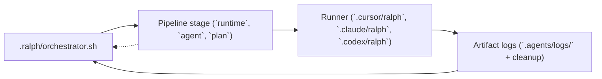

# Ralph agent workflow (quick reference)

## Plan-first loop

1. Write a markdown plan with checkboxes: `- [ ]` todo, `- [x]` done.
2. Run a runner until all items are checked:

   - Cursor: `.cursor/ralph/run-plan.sh --plan PLAN.md`
   - Claude: `.claude/ralph/run-plan.sh --plan ...`
   - Codex: `.codex/ralph/run-plan.sh --non-interactive --plan ...`

3. With **`--agent <id>`**, the runner loads that id under `.cursor/agents/`, `.claude/agents/`, or `.codex/agents/`. Try **`architect`** or **`research`** after install. The **agent-config-tool** under `.ralph/` validates and builds context for all runtimes.

## Multi-stage orchestration

1. Copy `.ralph/orchestration.template.json` and `.ralph/orchestration.template.md`.
2. Each stage has `"runtime": "cursor" | "claude" | "codex"`, `"agent"`, and `"plan"`.
3. Run: `.ralph/orchestrator.sh path/to/pipeline.orch.json`

## Visual flow



Each stage drives the runtime-specific plan runner, which in turn writes logs and cleaned-up artifacts before the orchestrator advances to the next stage in the JSON pipeline.

### Using the runners

1. **Create plans** (single agent or per stage) from `.ralph/plan.template`. Todo items must use `- [ ]` or `- [x]` because `get_next_todo` matches that exact syntax.
2. **Run the appropriate CLI** noted in `README.md`:
   - `.cursor/ralph/run-plan.sh` for Cursor (honors `CURSOR_PLAN_MODEL`, `--agent`, `--plan`, `--select-agent`).
   - `.claude/ralph/run-plan.sh` for Claude (respecting `CLAUDE_PLAN_MODEL` and similar flags).
   - `.codex/ralph/run-plan.sh` for Codex (`--non-interactive` by default, honoring `CODEX_PLAN_MODEL`).
3. **Handle human input**: the runner may exit with artifacts like `HUMAN-INPUT-REQUIRED.md`. Write the response, reopen the CLI, and rerun the same plan so the first unchecked todo is replayed.
4. **Logs and artifacts**: After each run, inspect `.agents/logs/plan-runner-*.log` for stdout and error details, and `.agents/artifacts/{{ARTIFACT_NS}}/` for generated docs. Use `.ralph/cleanup-plan.sh <namespace>` to wipe logs/artifacts before a fresh run.
5. **Subagents and teams**: Refer to the README’s links (Cursor subagents, Claude subagents, Claude agent teams, Codex subagents/multi-agent) to understand how to delegate work inside your plan or orchestrator stages. For using Claude Code agent teams with Ralph (spawning teammates for tasks, artifact handoffs, and when to use teams vs orchestrator), see [Claude Code agent teams with Ralph](CLAUDE-AGENT-TEAMS.md).

### Claude headless stalls on permission or new files

Claude Code in `-p` mode only auto-approves tools in `--allowedTools`. New files use the **Write** tool; **Edit** is for existing files. The Ralph Claude runner defaults to `Bash,Read,Edit,Write`. If you set `CLAUDE_PLAN_ALLOWED_TOOLS` without **Write**, creating artifacts (e.g. `code-review.md`) can hang. See [Claude headless / auto-approve tools](https://code.claude.com/docs/en/headless).

### Helpful references

- Cursor’s Ralph runner internals: `bundle/.cursor/ralph/README.md`
- Cursor subagent architecture: [https://cursor.com/docs/subagents](https://cursor.com/docs/subagents)
- Claude subagents doc: [https://docs.anthropic.com/en/docs/claude-code/subagents](https://docs.anthropic.com/en/docs/claude-code/subagents)
- Claude agent teams: [https://code.claude.com/docs/en/agent-teams](https://code.claude.com/docs/en/agent-teams); using them with Ralph: [CLAUDE-AGENT-TEAMS.md](CLAUDE-AGENT-TEAMS.md)
- Codex subagent concepts: [https://developers.openai.com/codex/concepts/subagents](https://developers.openai.com/codex/concepts/subagents)
- Codex multi-agent guide: [https://developers.openai.com/codex/multi-agent](https://developers.openai.com/codex/multi-agent)
- Worker example walkthrough: [`docs/worker-ralph-example.md`](docs/worker-ralph-example.md)
- Orchestrated example walkthrough: [`docs/orchestrated-ralph-example.md`](docs/orchestrated-ralph-example.md)

### Sample prompts & templates

Use the prompts below to build structured plans that are ready for the plan runners:

**Worker plan prompt**

```
I need a worker plan for [TASK]. Start with `.ralph/plan.template` and save the output as `PLAN.md`.

Break the task into discrete TODOs (`- [ ]`). For each item, mention the files to touch, commands to run for validation (lint/tests), and any artifact that should result (research notes, documentation, QA checklist). The plan should be explicit enough that the runner can check `- [x]` once the change is complete.
```

**Stage plan prompt for orchestrations**

```
Create three stage plans (research, architecture, implementation) using `.ralph/plan.template`. Save each to `.agents/orchestration-plans/<namespace>/<namespace>-01-research.plan.md`, `.agents/orchestration-plans/<namespace>/<namespace>-02-architecture.plan.md`, etc.

Include:
- Research tasks that explore modules/files, gather questions, and capture findings in `.agents/artifacts/{{ARTIFACT_NS}}/research.md`.
- Architecture tasks that produce design docs, interfaces, and artifact handoffs like `.agents/artifacts/{{ARTIFACT_NS}}/architecture.md`.
- Implementation tasks that list files/commands, include verification steps (`npm run lint`, `npm run test`), and mention QA or rollback notes.
```

### Orchestration JSON example

```json
{
  "name": "my-feature-pipeline",
  "namespace": "my-feature",
  "description": "Multi-stage pipeline for notifications work.",
  "stages": [
    {
      "id": "research",
      "runtime": "cursor",
      "agent": "research",
      "plan": ".agents/orchestration-plans/my-feature/my-feature-01-research.plan.md",
      "artifacts": [
        {
          "path": ".agents/artifacts/{{ARTIFACT_NS}}/research.md",
          "required": true
        }
      ]
    },
    {
      "id": "implementation",
      "runtime": "claude",
      "agent": "implementation",
      "plan": ".agents/orchestration-plans/my-feature/my-feature-02-implementation.plan.md",
      "inputArtifacts": [
        {
          "path": ".agents/artifacts/{{ARTIFACT_NS}}/research.md"
        }
      ],
      "artifacts": [
        {
          "path": ".agents/artifacts/{{ARTIFACT_NS}}/implementation-handoff.md",
          "required": true
        }
      ]
    },
    {
      "id": "code-review",
      "runtime": "codex",
      "agent": "code-review",
      "plan": ".agents/orchestration-plans/my-feature/my-feature-03-code-review.plan.md",
      "inputArtifacts": [
        {
          "path": ".agents/artifacts/{{ARTIFACT_NS}}/implementation-handoff.md"
        }
      ],
      "artifacts": [
        {
          "path": ".agents/artifacts/{{ARTIFACT_NS}}/code-review.md",
          "required": true
        }
      ],
      "loopControl": {
        "loopBackTo": "implementation",
        "maxIterations": 2
      }
    }
  ]
}
```

## New prebuilt agent

From repo root (after you have `.ralph/new-agent.sh` from this bundle):

```bash
bash .ralph/new-agent.sh
```

Scaffolds agent folders under `.cursor/agents/`, `.claude/agents/`, and `.codex/agents/` when those CLIs exist. Non-interactive: `bash .ralph/new-agent.sh --non-interactive` with `CURSOR_PLAN_MODEL` (and Claude/Codex model envs if needed).

## Model selection

Each runtime includes `select-model.sh` next to `run-plan.sh`. Runners respect `CURSOR_PLAN_MODEL`, `CLAUDE_PLAN_MODEL`, `CODEX_PLAN_MODEL` for automation.

## Cleanup

After a run you can: `.ralph/cleanup-plan.sh <artifact-namespace>` to purge logs and artifacts.
