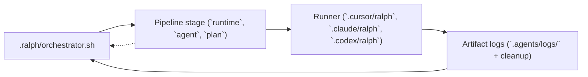

# Ralph agent workflow (quick reference)

## Plan-first loop

1. Write a markdown plan with checkboxes: `- [ ]` todo, `- [x]` done. Open tasks must use that exact `- [ ]` form (space inside the brackets). `- []` is not a task line and is ignored by the runners.
2. Run a runner until all items are checked:

   - Cursor: `.ralph/run-plan.sh --runtime cursor --plan PLAN.md`
   - Claude: `.ralph/run-plan.sh --runtime claude --plan ...`
   - Codex: `.ralph/run-plan.sh --runtime codex --non-interactive --plan ...`

3. With **`--agent <id>`**, the runner loads that id under `.cursor/agents/`, `.claude/agents/`, or `.codex/agents/`. Try **`architect`** or **`research`** after install. The **agent-config-tool** under `.ralph/` validates and builds context for all runtimes.

## Multi-stage orchestration

1. Copy `.ralph/orchestration.template.json` and `.ralph/orchestration.template.md`.
   Alternatively, run `.ralph/orchestration-wizard.sh` to choose a pipeline name/namespace, pick runtimes and agents for each stage, and let the wizard scaffold the plan files plus `.orch.json` under `.agents/orchestration-plans/<namespace>/`.
2. Each stage has `"runtime": "cursor" | "claude" | "codex"`, `"agent"`, and `"plan"`.
3. Run: `.ralph/orchestrator.sh --orchestration path/to/pipeline.orch.json` or `.ralph/orchestrator.sh path/to/pipeline.orch.json` (both forms are supported; see the usage block in `.ralph/orchestrator.sh`).

## Visual flow



Each stage drives the runtime-specific plan runner, which in turn writes logs and cleaned-up artifacts before the orchestrator advances to the next stage in the JSON pipeline.

### Using the runners

1. **Create plans** (single agent or per stage) from `.ralph/plan.template`. Todo items must use `- [ ]` or `- [x]`; other checkbox shapes (for example `- []`) are ignored.
2. **Install the vendor CLI** you use (Cursor agent, `claude`, or `codex`) so the runner can invoke it. Then run:
   - **`.ralph/run-plan.sh --runtime cursor|claude|codex --plan <path>`** -- the single plan runner (**`--plan` is required**). Each runtime has its own env prefix (`CURSOR_PLAN_*`, `CLAUDE_PLAN_*`, `CODEX_PLAN_*`) and supports the same optional flags (`--agent`, `--select-agent`, `--non-interactive`, `--model`, etc.).
3. **Handle human input**: The runner follows an **interactive-first flow**: TTY-attached runs prompt inline on `/dev/tty` and continue in the same process (multiline answers may include blank lines; end input with a line containing only `.`). When stdin/stdout are not a TTY (for example under the orchestrator), `.ralph/run-plan.sh` still **pauses in-process**: it writes `pending-human.txt`, `HUMAN-INPUT-REQUIRED.md`, and a placeholder `operator-response.txt`, then polls until you save a real answer (override poll interval with `RALPH_HUMAN_POLL_INTERVAL`). Optional escalation to `.ralph/orchestrator.sh --human-ack` or `RALPH_HUMAN_ACK_TOOL` can run first for bridges. Set `RALPH_HUMAN_OFFLINE_EXIT=1` only if you need the old behavior (exit 4 and restart after editing files).

   Every human exchange (question + answer) is also persisted under `.agents/<artifact-namespace>/human`, giving you a namespace- scoped audit trail to review what was asked, who answered it, and what needs to be replayed before resuming the plan.
4. **Logs and artifacts**: After each run, inspect `.agents/logs/plan-runner-*.log` for stdout and error details, and `.agents/artifacts/{{ARTIFACT_NS}}/` for generated docs. Use `.ralph/cleanup-plan.sh <namespace>` to wipe logs/artifacts before a fresh run.
5. **Subagents and teams**: The vendor docs for Cursor, Claude, and Codex explain subagents and multi-agent flows; use those when you split work inside a plan or a stage. For Claude Code **agent teams** specifically (teammates, handoffs, teams vs orchestrator), see [Claude Code agent teams with Ralph](CLAUDE-AGENT-TEAMS.md).

### Claude headless stalls on permission or new files

Claude Code in `-p` mode only auto-approves tools in `--allowedTools`. New files use the **Write** tool; **Edit** is for existing files. The Ralph Claude runner defaults to `Bash,Read,Edit,Write`. If you set `CLAUDE_PLAN_ALLOWED_TOOLS` without **Write**, creating artifacts (e.g. `code-review.md`) can hang. See [Claude headless / auto-approve tools](https://code.claude.com/docs/en/headless).

### Helpful references

- Cursor’s Ralph runner internals: `.cursor/ralph/README.md`
- Cursor subagent architecture: [https://cursor.com/docs/subagents](https://cursor.com/docs/subagents)
- Claude subagents doc: [https://docs.anthropic.com/en/docs/claude-code/subagents](https://docs.anthropic.com/en/docs/claude-code/subagents)
- Claude agent teams: [https://code.claude.com/docs/en/agent-teams](https://code.claude.com/docs/en/agent-teams); using them with Ralph: [CLAUDE-AGENT-TEAMS.md](CLAUDE-AGENT-TEAMS.md)
- Codex subagent concepts: [https://developers.openai.com/codex/concepts/subagents](https://developers.openai.com/codex/concepts/subagents)
- Codex multi-agent guide: [https://developers.openai.com/codex/multi-agent](https://developers.openai.com/codex/multi-agent)
- Worker example walkthrough: [worker-ralph-example.md](worker-ralph-example.md)
- Orchestrated example walkthrough: [orchestrated-ralph-example.md](orchestrated-ralph-example.md)

### Sample prompts & templates

Use the prompts below to build structured plans that are ready for the plan runners:

**Worker plan prompt**

```
I need a worker plan for [TASK]. Start with `.ralph/plan.template` and save the output as `PLAN.md`.

Break the task into discrete TODOs (`- [ ]`). For each item, mention the files to touch, commands to run for validation (lint/tests), and any artifact that should result (research notes, documentation, QA checklist). The plan should be explicit enough that the runner can check `- [x]` once the change is complete.
```

**Stage plan prompt for orchestrations**

```text
Create three stage plans (research, architecture, implementation)
using `.ralph/plan.template`.

Save each plan under `.agents/orchestration-plans/<namespace>/`:
- `<namespace>-01-research.plan.md`
- `<namespace>-02-architecture.plan.md`
- `<namespace>-03-implementation.plan.md`

Include:
- Research tasks that explore modules/files, gather questions, and capture findings in `.agents/artifacts/{{ARTIFACT_NS}}/research.md`.
- Architecture tasks that produce design docs, interfaces, and artifact handoffs like `.agents/artifacts/{{ARTIFACT_NS}}/architecture.md`.
- Implementation tasks that list files/commands, include verification steps (`npm run lint`, `npm run test`), and mention QA or rollback notes.
```

**Orchestration spec prompt**

```text
I am coordinating [FEATURE] across Cursor, Claude, and Codex.
Each stage plan already exists under
`.agents/orchestration-plans/<namespace>/`.

Produce `.agents/orchestration-plans/<namespace>/<namespace>.orch.json`
that:
- wires those stage plans together,
- assigns a runtime and agent for each stage,
- lists required artifact files (research.md, architecture.md,
  implementation-handoff.md, etc.).

If a reviewer should send work back to an earlier stage,
include `loopControl`.
```

### Orchestration JSON example

```json
{
  "name": "my-feature-pipeline",
  "namespace": "my-feature",
  "description": "Multi-stage pipeline for notifications work.",
  "stages": [
    {
      "id": "research",
      "runtime": "cursor",
      "agent": "research",
      "plan": ".agents/orchestration-plans/my-feature/my-feature-01-research.plan.md",
      "artifacts": [
        {
          "path": ".agents/artifacts/{{ARTIFACT_NS}}/research.md",
          "required": true
        }
      ]
    },
    {
      "id": "implementation",
      "runtime": "claude",
      "agent": "implementation",
      "plan": ".agents/orchestration-plans/my-feature/my-feature-02-implementation.plan.md",
      "inputArtifacts": [
        {
          "path": ".agents/artifacts/{{ARTIFACT_NS}}/research.md"
        }
      ],
      "artifacts": [
        {
          "path": ".agents/artifacts/{{ARTIFACT_NS}}/implementation-handoff.md",
          "required": true
        }
      ]
    },
    {
      "id": "code-review",
      "runtime": "codex",
      "agent": "code-review",
      "plan": ".agents/orchestration-plans/my-feature/my-feature-03-code-review.plan.md",
      "inputArtifacts": [
        {
          "path": ".agents/artifacts/{{ARTIFACT_NS}}/implementation-handoff.md"
        }
      ],
      "artifacts": [
        {
          "path": ".agents/artifacts/{{ARTIFACT_NS}}/code-review.md",
          "required": true
        }
      ],
      "loopControl": {
        "loopBackTo": "implementation",
        "maxIterations": 2
      }
    }
  ]
}
```

## New prebuilt agent

From your project root (where `.ralph/` lives):

```bash
bash .ralph/new-agent.sh
```

Scaffolds agent folders under `.cursor/agents/`, `.claude/agents/`, and `.codex/agents/` when those CLIs exist. Non-interactive: `bash .ralph/new-agent.sh --non-interactive` with `CURSOR_PLAN_MODEL` (and Claude/Codex model envs if needed).

## Cleanup

After a run you can: `.ralph/cleanup-plan.sh <artifact-namespace>` to purge logs and artifacts.
