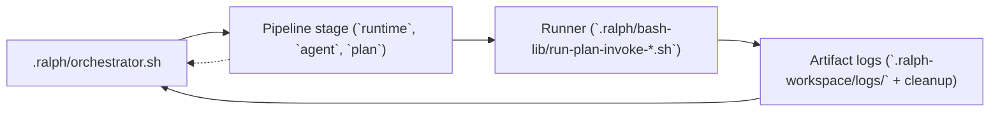

# Ralph agent workflow (quick reference)

## Plan-first loop

1. Use `ralph create plan` to scaffold a single plan. `--format classic` creates the zero-dependency markdown checklist path; `--format yaml` creates the flat YAML-frontmatter TODO queue. For a staged multi-agent pipeline, use `ralph create workflow --mode sequential`.
2. Write tasks with the expected syntax for the chosen format: classic uses markdown checkboxes (`- [ ]` todo, `- [x]` done); yaml uses frontmatter TODOs; orchestration uses stage TODOs plus artifacts.
3. Open tasks in classic plans must use that exact `- [ ]` form (space inside the brackets). `- []` is not a task line and is ignored by the runners.
4. Run a runner until all items are checked:

   - Cursor: `.ralph/run-plan.sh --runtime cursor --plan PLAN.md`
   - Claude: `.ralph/run-plan.sh --runtime claude --plan ...`
   - Codex: `.ralph/run-plan.sh --runtime codex --non-interactive --plan ...`
   - OpenCode: `.ralph/run-plan.sh --runtime opencode --plan ...`
   - Antigravity: `.ralph/run-plan.sh --runtime antigravity --plan ...`
   - Antigravity: `.ralph/run-plan.sh --runtime antigravity --plan ...` (models from `agy models`; passed to `agy --model "<exact model string from agy models>"`)

**Three-root model:** Ralph separates the **project root** (folder with `.ralph/` and project-relative plans), the **state root** (directory containing `.ralph-workspace/` logs, artifacts, and sessions; default `<project>/.ralph-workspace`, overridable via `--workspace-root` or `RALPH_PLAN_WORKSPACE_ROOT`), and the **agent workspace** (sandboxed work tree for model file access; default: the directory that invoked `run-plan.sh`, overridable via `--agent-workspace` or `RALPH_AGENT_WORKSPACE`). Most plan and doc paths resolve against the project root; paths under `.ralph-workspace/` resolve against the state root. YAML-format runs still write the normal plan-runner logs under `.ralph-workspace/logs/` and artifacts under `.ralph-workspace/artifacts/`. See [AGENTS.md](../AGENTS.md#three-root-model) for defaults, compatibility, and examples.

Stage guidance for reusable SDLCs lives in workflow stage `instructions:` (non-empty text). There is no separate public role resource or CLI for instruction packs.

## Durable TODO continuations (background jobs)

A TODO can wait on a long command without spending model turns on polling when background jobs are **explicitly opted in** (`RALPH_BG_JOBS=1`; default `0` / off). Full env table: [ENVIRONMENT.md](ENVIRONMENT.md#background-jobs-and-durable-todo-continuations). Stop hook contract and cost model: [TOOLING.md](TOOLING.md#background-jobs-and-stop-hook-continuation).

- **Tier 1 (preferred):** `.ralph/ralph-bg.sh '<command>'` then end the turn without a completion marker. The runtime Stop / stop hook waits outside the model and the same session continues.
- **Tier 2 (fallback):** no usable hook or no process isolation — the runner waits outside the model and resumes the **same TODO** on its exact captured session id.
- **Human answers** always cross invocations the same way: answer injects once into that TODO's next invocation; `RALPH_PLAN_SESSION_STRATEGY=fresh` only isolates the *next distinct* TODO — it does not restart a suspended mid-TODO wait from scratch.
- Prefer plan/TODO strict `verify:` for completion gates. Do not author agent-side polling loops; async MCP shell tools remain a manual human-monitoring fallback, not the automation path.

## Workflow operator input

Inside a workflow-owned stage or generated-plan TODO, continue autonomously when
repository evidence supports the choice. When a missing product decision,
unavailable credential *configuration*, external fact, or mutually exclusive
requirement blocks safe progress, request operator input and **stop without
completing the TODO**:

```bash
ralph workflow actions request --question "Should CSV export include refunded invoices?" \
  [--details "Affects report totals and tax lines."]
```

Never put secret values in the question or details—ask the operator to configure
a named environment or native secret source and reply when ready. At most one
outstanding `input` request per attempt. The request does not grant permission
and does not mutate the plan.

Outstanding input leaves the TODO unchecked, marks the stage/run non-retryable
`waiting`, and exits **3** (persisted wait, not failure). The operator answers
with the same run and request IDs from `ralph workflow actions list` / status:

```bash
ralph workflow actions list run-20260827T200100Z-human-verified-delivery-c0ffee
ralph workflow actions respond run-20260827T200100Z-human-verified-delivery-c0ffee req-input-42 \
  --decision answer --message "Include refunded invoices as negative lines." --yes
ralph workflow resume run-20260827T200100Z-human-verified-delivery-c0ffee --yes
```

`--decision answer` requires a non-empty `--message`. Resume injects the answer
and request ID into a delimited block for **the same TODO's** next
invocation exactly once (that TODO continues; a cross-TODO `fresh` strategy
does not wipe this mid-TODO continuation), then continues the same mutable
control plan. Use
`--decision cancel` to cancel the run instead.

Standalone leaf plans (outside a workflow run) still use the session
`pending-human.txt` / `operator-response.txt` bridge below. Do not call
`ralph workflow actions request` from a standalone plan.

Full choose/inspect/start/status/approval/reset journeys with exact run IDs:
[WORKFLOWS.md](WORKFLOWS.md#operation-command-map).

## Who executes and who owns the work

Keep these terms separate when authoring a plan or prompt:

- **Runtime agent:** The agent/session supplied by Cursor, Claude, Codex, OpenCode, or Antigravity. It is the execution identity for the run, receives the prompt, uses the runtime's tools, and owns product changes in its assigned agent workspace.
- **Workflow stage instructions:** Inline `instructions:` text on an ordinary workflow stage. It focuses the work (for example, research or QA) but does not execute, select a model, own a workspace, or own artifacts.
- **Runtime-native subagent:** A child assistant launched by the runtime agent through the runtime's own subagent feature. The runtime owns its lifecycle. Its findings return to the parent runtime agent; the parent remains owner of the Ralph TODO and its declared artifacts unless the parent explicitly records a result.
- **Delegated run:** A Ralph-supervised child execution requested by a runtime agent. It has its own execution boundary and may have its own runtime, prompt, and declared result artifacts. The child owns only those explicitly assigned result artifacts or changes; the parent owns the initiating TODO, final verification, and completion decision.

### Artifact ownership

The runtime agent writes the task's product changes and any explicitly requested task artifacts in its assigned workspace. Ralph owns runner state such as plan progress, logs, sessions, and completion checks. Workflow stage instructions own no files. A runtime-native subagent does not become a separate Ralph artifact owner. A delegated run owns only its explicitly declared result artifacts or changes, and its parent must receive and verify the result before treating the parent TODO as complete.

The word **agent** is intentionally retained for the provider-supplied runtime agent, vendor documentation, `--agent-workspace`, and other runtime-native CLI surfaces. **Subagent** is intentionally retained for a provider's native child assistant. These terms do not refer to workflow stage instructions.

## Multi-stage workflows

1. Use `ralph create workflow --mode sequential` or `--mode dependency` to scaffold a reusable workflow. Stages carry inline `instructions:`, optional TODOs / `planFile` / `planFrom` / `planner`, and artifacts.
2. Ordinary stages may declare `runtime` and `model`; supervisors reject those fields. Put behavioral guidance in `instructions:`, not a separate role resource.
3. Start with `ralph workflow start <id> --task "..."` or `ralph workflow start --file <path> --task "..."` (supplied plans: `--plan <leaf-plan-path>`). Do not pass workflow-shaped inputs to `ralph run --plan`.

### Routing and validation

TODOs and stages route by `runtime` and optional `model` under the fixed precedence in [WORKFLOWS.md](WORKFLOWS.md) / [ENVIRONMENT.md](ENVIRONMENT.md). The runner rejects TODOs that do not satisfy the current format's required metadata; workflow engines reject missing required artifacts.

Pipeline orchestration shares context with explicit artifact declarations. Use `produces` and `requires` artifact declarations, plus explicit artifact paths in TODO content, so required inputs are surfaced in the prompt automatically.

### Artifact JSON schemas (optional)

Stages may attach an optional `schema` field to entries in `artifacts`, `inputArtifacts`, and `outputArtifacts`. The value is a **project-root-relative** path to a JSON Schema document. Schema paths support the same namespace placeholders as artifact paths: `{{ARTIFACT_NS}}`, `{{PLAN_KEY}}`, and `{{STAGE_ID}}`.

```json
{
  "path": ".ralph-workspace/artifacts/{{ARTIFACT_NS}}/review.json",
  "required": true,
  "schema": "bundle/.ralph/schemas/evaluator-verdict.schema.json"
}
```

YAML pipeline plans accept the same field on `requires` / `produces` entries; `plan-todo.sh` preserves `schema` when converting to `.orch.json`.

**Plan validation:** `bash scripts/validate-orchestration-schema.sh <file.orch.json> <workspace>` checks orchestration shape with `jq`, then validates every declared schema path (reject absolute paths, `..` traversal, `.env*` paths, missing files, empty files, and paths outside the project root). When no artifact declares `schema`, the optional workspace argument is not required.

**Runtime validation timing:** After a stage finishes, the orchestrator verifies required artifacts exist and are non-empty, then validates produced artifacts that declare `schema` **before** advancing to the next stage or injecting downstream handoffs. Validation uses Ralph's stdlib JSON Schema subset validator (`bundle/.ralph/python/artifact_json_schema.py`); no third-party Python packages are required.

Failures identify **stage id**, **artifact path**, **schema path**, and the **JSON location** (for example `$` or `/feedback`).

Bundled contract schemas live under `bundle/.ralph/schemas/` (`evaluator-verdict`, `router-decision`, `planner-output`, `rubric-result`). They are reference contracts for later evaluator, router, planner, and rubric stages; declaring `schema` on a stage artifact is optional and backward compatible when omitted.

**Feature gate:** `RALPH_ARTIFACT_SCHEMA_VALIDATION` follows the cookbook rollout convention. In `RALPH_MODE=ralph` or `hybrid`, validation is on unless the variable is set to `0`. In native/no mode, validation is off unless the variable is set to `1`.

### Artifact provenance citations (optional)

Stages and agent `output_artifacts` may declare `provenance: required|optional|none` (default `optional`). When enabled, Ralph validates citations **after** JSON schema validation and **before** downstream handoff injection.

**File citations** use a project-relative path, 1-based line number, and an optional bounded quoted excerpt:

```markdown
- cite: bundle/.ralph/orchestrator.sh:829
- cite: bundle/.ralph/orchestrator.sh:829 "verify_stage_artifact_schemas"
```

**Generated artifact citations** use an artifact path plus a Markdown heading or JSON pointer:

```markdown
- cite: .ralph-workspace/artifacts/{{ARTIFACT_NS}}/architecture.md#Module-boundaries
- cite: .ralph-workspace/artifacts/{{ARTIFACT_NS}}/review.json#/feedback/0
```

JSON artifacts may include an optional top-level `citations` array (see `bundle/.ralph/schemas/citation.schema.json`):

```json
{
  "citations": [
    {"ref": "bundle/.ralph/run-plan.sh:120", "excerpt": "optional excerpt"}
  ]
}
```

When `provenance` is `required`, at least one valid citation must be present. When `optional` (the default), existing artifacts without citations remain valid; any supplied citations are checked for path safety, line range, traversal rejection, and excerpt match. External URL validation is out of scope for the dependency-free core.

Research, architect, code-review, QA, and security agent profiles include provenance guidance for material repository claims.

**Feature gate:** `RALPH_ARTIFACT_PROVENANCE` follows the same rollout convention as artifact schema validation.

### Evaluator verdict contract and loopback feedback

A review/QA/security stage that drives a loop can declare an evaluator schema for its loop-check artifact. Two equivalent surfaces exist:

- YAML pipeline stage: `loopCheck.schema: <project-root-relative schema path>` (alongside `loopCheck.path`), plus an optional `onExhausted: proceed|fail`.
- Generated `.orch.json`: `loopControl.evaluatorSchema` and `loopControl.onExhausted` (produced automatically from the YAML form).

The canonical evaluator artifact is:

```json
{"status": "approved|changes-required", "feedback": ["string", ...]}
```

`feedback` is required; it may be empty only when `status` is `approved`, and `changes-required` must include at least one non-empty entry. The bundled schema is `bundle/.ralph/schemas/evaluator-verdict.schema.json`.

When a loop-check artifact declares an evaluator schema and the JSON-contract gate is enabled, Ralph parses **only** the validated JSON contract for that artifact (no free-form status fallback). When no schema is declared, the legacy `<!-- REVIEW_STATUS: START -->` / `status: ...` markdown parser remains in effect, so existing plans are unchanged.

On `changes-required`, the reviewer feedback is injected verbatim and in order into the looped-back plan inside a delimited block (`<!-- RALPH_EVALUATOR_FEEDBACK: START -->` ... `END`) that records the source stage, iteration, and artifact path. Feedback bytes are preserved; a Markdown fence longer than any backtick run in the feedback is used to prevent fence breakouts, and the rendered block is only ever written to a file (never evaluated by a shell).

When the loop reaches `maxIterations` while the review still requires changes, the run stops with a non-zero exit unless the stage declares `onExhausted: proceed`.

**Feature gate:** `RALPH_EVALUATOR_JSON_CONTRACT` follows the same rollout convention as artifact schema validation (`RALPH_MODE=ralph`/`hybrid` on unless `0`; native/no off unless `1`; invalid values fail early).

### Router stage (optional)

Orchestration JSON may include a stage with a `router` block. When `RALPH_ROUTER_STAGE=1` (or Ralph/hybrid default), Ralph validates router output against `bundle/.ralph/schemas/router-decision.schema.json` and dispatches forward to a named stage. Routers cannot loop backward; use `loopControl` for review loops.

**Feature gate:** `RALPH_ROUTER_STAGE` follows the cookbook rollout convention.

### Rubric grader (optional)

Stages with `sessionStrategy: fresh` and a rubric artifact may use `bundle/.ralph/python/rubric_grader.py` for deterministic checks (`file_exists`, `json_pointer`, `regex`, `command`, `citation`) before optional model judgment criteria. Results validate against `bundle/.ralph/schemas/rubric-result.schema.json`.

**Feature gate:** `RALPH_RUBRIC_GRADER` follows the cookbook rollout convention.

### Dynamic planner stage (optional)

A stage may declare a `planner` block with caps on generated todos/stages and allowed runtimes/agents/models. Output validates against `bundle/.ralph/schemas/planner-output.schema.json` and materializes under the state root without overwriting operator plans.

**Feature gate:** `RALPH_DYNAMIC_PLANNER` follows the cookbook rollout convention.

## Visual flow


```mermaid
flowchart LR
    orchestrator["`.ralph/orchestrator.sh`"]
    stage["Pipeline stage (`runtime`, `agent`, `plan`)"]
    runner["Runner (`.ralph/bash-lib/run-plan-invoke-*.sh`)"]
    logs["Artifact logs (`.ralph-workspace/logs/<namespace>` + cleanup)"]
    orchestrator --> stage
    stage --> runner
    runner --> logs
    logs --> orchestrator
    stage -.-> orchestrator
```

Each stage drives the unified plan runner, which in turn writes logs and cleaned-up artifacts before the orchestrator advances to the next stage in the JSON pipeline or the pipeline execution flow.

### Using the runners

1. **Create plans** with `ralph create plan` (`--format classic` for the zero-dependency checklist, `--format yaml` for the flat YAML TODO queue) or `ralph create workflow --mode sequential` for staged workflows. YAML and orchestration plans require `python3`; classic plans do not.
2. **Install the vendor CLI** you use (Cursor agent, `claude`, `codex`, `opencode`, or `agy`) so the runner can invoke it. Then run:
   - **`.ralph/run-plan.sh --runtime cursor|claude|codex|opencode|antigravity --plan <path>`** -- the single leaf-plan runner (**`--plan` is required**). Each runtime has its own env prefix (`CURSOR_PLAN_*`, `CLAUDE_PLAN_*`, `CODEX_PLAN_*`, `OPENCODE_PLAN_*`, `ANTIGRAVITY_PLAN_*`) and supports the same optional flags (`--non-interactive`, `--model`, etc.). Antigravity model ids come from `agy models` and are passed unchanged to `agy --model "<exact model string from agy models>"`. For reusable SDLCs use `ralph workflow start` instead of passing workflow-shaped inputs to `ralph run --plan`.
3. **Handle human input**:
   - **Workflow runs:** use `ralph workflow actions request` / `respond ... --decision answer` (see [Workflow operator input](#workflow-operator-input)). Status/resume/reset/recover use the exact run ID from start; never `latest`.
   - **Standalone leaf plans:** the runner follows an **interactive-first flow**: TTY-attached runs prompt inline on `/dev/tty` and continue in the same process (multiline answers may include blank lines; end input with a line containing only `.`). When stdin/stdout are not a TTY (for example under the orchestrator), `.ralph/run-plan.sh` still **pauses in-process**: under **`.ralph-workspace/sessions/<RALPH_PLAN_KEY>/`** it writes `pending-human.txt`, `HUMAN-INPUT-REQUIRED.md`, and a placeholder `operator-response.txt`, then polls until you save a real answer (override poll interval with `RALPH_HUMAN_POLL_INTERVAL`). Optional escalation via `RALPH_HUMAN_ACK_TOOL` can run first for bridges (the orchestrator script itself does not expose `--human-ack`). Set `RALPH_HUMAN_OFFLINE_EXIT=1` only if you need the old behavior (exit 4 and restart after editing files).

   Every standalone human exchange (question + answer) is also appended to **`human-replies.md`** in that session directory, giving you a namespace-scoped audit trail to review what was asked, who answered it, and what needs to be replayed before resuming the plan. Workflow input decisions live under the run registry `actions/` tree instead.
4. **Logs and artifacts**: After each run, inspect `.ralph-workspace/logs/<namespace>/plan-runner-*.log` for stdout and error details, and `.ralph-workspace/artifacts/{{ARTIFACT_NS}}/` for generated docs. YAML-format runs use the same normal plan-runner logs. Use `.ralph/cleanup-plan.sh <namespace>` to wipe logs, session files, and artifacts before a fresh run.
5. **Subagents and teams**: The vendor docs for Cursor, Claude, Codex, OpenCode, and Antigravity explain subagents and multi-agent flows; use those when you split work inside a plan or a stage. For Claude Code **agent teams** specifically (teammates, handoffs, teams vs orchestrator), see [Claude Code agent teams with Ralph](CLAUDE-AGENT-TEAMS.md).

### Claude headless stalls on permission or new files

Claude Code in `-p` mode only auto-approves tools in `--allowedTools`. New files use the **Write** tool; **Edit** is for existing files. The Ralph Claude runner defaults to `Bash,Read,Edit,Write`. If you set `CLAUDE_PLAN_ALLOWED_TOOLS` without **Write**, creating artifacts (e.g. `code-review.md`) can hang. See [Claude headless / auto-approve tools](https://code.claude.com/docs/en/headless).

### Helpful references

- Ralph runner internals: `.ralph/bash-lib/README.md`
- Cursor subagent architecture: [https://cursor.com/docs/subagents](https://cursor.com/docs/subagents)
- Claude subagents doc: [https://docs.anthropic.com/en/docs/claude-code/subagents](https://docs.anthropic.com/en/docs/claude-code/subagents)
- Claude agent teams: [https://code.claude.com/docs/en/agent-teams](https://code.claude.com/docs/en/agent-teams); using them with Ralph: [CLAUDE-AGENT-TEAMS.md](CLAUDE-AGENT-TEAMS.md)
- Codex subagent concepts: [https://developers.openai.com/codex/concepts/subagents](https://developers.openai.com/codex/concepts/subagents)
- Codex multi-agent guide: [https://developers.openai.com/codex/multi-agent](https://developers.openai.com/codex/multi-agent)
- Worker example walkthrough: [worker-ralph-example.md](worker-ralph-example.md)
- Orchestrated example walkthrough: [orchestrated-ralph-example.md](orchestrated-ralph-example.md)

### Sample prompts & templates

Use the prompts below to build yaml plans that are ready for the plan runners:

**Worker plan prompt**

```
I need a worker plan for [TASK]. Start with `.ralph/plan-templates/classic.plan.template.md` and save the output as `PLAN.md`.

Break the task into discrete TODOs (`- [ ]`). For each item, mention the files to touch, commands to run for validation (lint/tests), and any artifact that should result (research notes, documentation, QA checklist). The plan should be explicit enough that the runner can check `- [x]` once the change is complete.
```

**Stage plan prompt for orchestrations**

```text
Create three stage plans (research, architecture, implementation)
using `.ralph/plan-templates/classic.plan.template.md`.

Save each plan under `.ralph-workspace/orchestration-plans/<namespace>/`:
- `<namespace>-01-research.plan.md`
- `<namespace>-02-architecture.plan.md`
- `<namespace>-03-implementation.plan.md`

Include:
- Research tasks that explore modules/files, gather questions, and capture findings in `.ralph-workspace/artifacts/{{ARTIFACT_NS}}/research.md`.
- Architecture tasks that produce design docs, interfaces, and artifact handoffs like `.ralph-workspace/artifacts/{{ARTIFACT_NS}}/architecture.md`.
- Implementation tasks that list files/commands, include verification steps (`npm run lint`, `npm run test`), and mention QA or rollback notes.
```

**Orchestration spec prompt**

```text
I am coordinating [FEATURE] across Cursor, Claude, and Codex.
Each stage plan already exists under
`.ralph-workspace/orchestration-plans/<namespace>/`.

Produce a pipeline plan at `.ralph-workspace/orchestration-plans/<namespace>/<namespace>.plan.md`
that:
- wires those stage plans together using a `pipeline:` block,
- assigns a runtime and agent for each stage,
- lists required artifact files (research.md, architecture.md,
  implementation-handoff.md, etc.).

If a reviewer should send work back to an earlier stage,
include `loopControl`.
```

### Orchestration JSON example

```json
{
  "name": "my-feature-pipeline",
  "namespace": "my-feature",
  "description": "Multi-stage pipeline for notifications work.",
  "stages": [
    {
      "id": "research",
      "runtime": "cursor",
      "agent": "research",
      "plan": ".ralph-workspace/orchestration-plans/my-feature/my-feature-01-research.plan.md",
      "artifacts": [
        {
          "path": ".ralph-workspace/artifacts/{{ARTIFACT_NS}}/research.md",
          "required": true
        }
      ]
    },
    {
      "id": "implementation",
      "runtime": "claude",
      "agent": "implementation",
      "plan": ".ralph-workspace/orchestration-plans/my-feature/my-feature-02-implementation.plan.md",
      "inputArtifacts": [
        {
          "path": ".ralph-workspace/artifacts/{{ARTIFACT_NS}}/research.md"
        }
      ],
      "artifacts": [
        {
          "path": ".ralph-workspace/artifacts/{{ARTIFACT_NS}}/implementation-handoff.md",
          "required": true
        }
      ]
    },
    {
      "id": "code-review",
      "runtime": "codex",
      "agent": "code-review",
      "plan": ".ralph-workspace/orchestration-plans/my-feature/my-feature-03-code-review.plan.md",
      "inputArtifacts": [
        {
          "path": ".ralph-workspace/artifacts/{{ARTIFACT_NS}}/implementation-handoff.md"
        }
      ],
      "artifacts": [
        {
          "path": ".ralph-workspace/artifacts/{{ARTIFACT_NS}}/code-review.md",
          "required": true
        }
      ],
      "loopControl": {
        "loopBackTo": "implementation",
        "maxIterations": 2
      }
    }
  ]
}
```

## Cleanup

After a run you can: `.ralph/cleanup-plan.sh <artifact-namespace>` to purge logs and artifacts.
