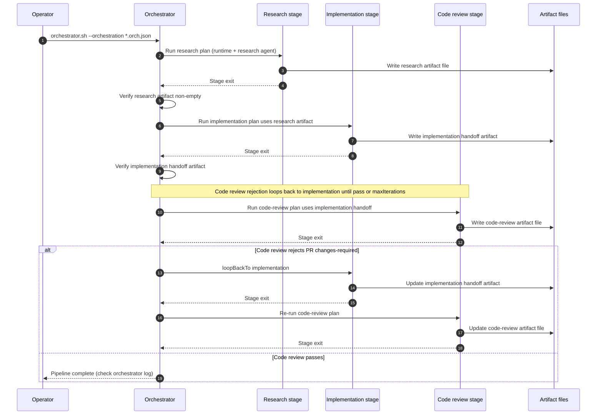

<!--- Example documenting orchestrated pipeline flow -->
# Orchestrated Ralph walkthrough

This guide demonstrates building a multi-stage pipeline using `.ralph/orchestrator.sh`, stage plans, and artifact handoffs across Cursor, Claude, and Codex.

## 1. Stage plans

1. Copy `.ralph/plan.template` into stage files:

   ```bash
   cp .ralph/plan.template .agents/orchestration-plans/feature-01-research.plan.md
   cp .ralph/plan.template .agents/orchestration-plans/feature-02-architecture.plan.md
   cp .ralph/plan.template .agents/orchestration-plans/feature-03-implementation.plan.md
   ```

2. Populate each plan:

   - **Research plan** should explore modules, list questions, and point to `.agents/artifacts/{{ARTIFACT_NS}}/research.md`.
   - **Architecture plan** should describe design decisions, diagrams, and artifact expectations for `.agents/artifacts/{{ARTIFACT_NS}}/architecture.md`.
   - **Implementation plan** should enumerate files, commands (`npm run lint`, `npm run test`, etc.), and QA verification for `.agents/artifacts/{{ARTIFACT_NS}}/implementation-handoff.md`.

3. Every TODO entry needs explicit verification steps and artifact outputs so the orchestrator can validate them per stage.

## 2. JSON orchestration spec

Use `.ralph/orchestration.template.json` as the starting point, then edit:

```json
{
  "name": "notifications-pipeline",
  "namespace": "notifications",
  "description": "Research, design, and implement a new notification feature.",
  "stages": [
    {
      "id": "research",
      "runtime": "cursor",
      "agent": "research",
      "plan": ".agents/orchestration-plans/feature-01-research.plan.md",
      "artifacts": [
        {
          "path": ".agents/artifacts/{{ARTIFACT_NS}}/research.md",
          "required": true
        }
      ]
    },
    {
      "id": "architecture",
      "runtime": "claude",
      "agent": "architect",
      "plan": ".agents/orchestration-plans/feature-02-architecture.plan.md",
      "inputArtifacts": [
        {
          "path": ".agents/artifacts/{{ARTIFACT_NS}}/research.md"
        }
      ],
      "artifacts": [
        {
          "path": ".agents/artifacts/{{ARTIFACT_NS}}/architecture.md",
          "required": true
        }
      ]
    },
    {
      "id": "implementation",
      "runtime": "codex",
      "agent": "implementation",
      "plan": ".agents/orchestration-plans/feature-03-implementation.plan.md",
      "inputArtifacts": [
        {
          "path": ".agents/artifacts/{{ARTIFACT_NS}}/architecture.md"
        }
      ],
      "artifacts": [
        {
          "path": ".agents/artifacts/{{ARTIFACT_NS}}/implementation-handoff.md",
          "required": true
        }
      ],
      "loopControl": {
        "loopBackTo": "implementation",
        "maxIterations": 2
      }
    }
  ]
}
```

Set `runtime` per stage to decide if Cursor/Claude/Codex runs that piece. Use `loopControl` to rerun implementation if the review stage signals `status: changes-required`.

## 3. Running the orchestrator

```bash
.ralph/orchestrator.sh --orchestration .agents/orchestration-plans/notifications-pipeline.orch.json
```

Each stage executes the referenced plan with its runtime CLI. The orchestrator checks that required artifacts exist and are non-empty before moving to the next stage, so ensure plans write the expected artifact files.

## 4. Artifact contract verification

After every stage:

- Check `.agents/logs/orchestrator-<namespace>.log` for per-stage stdout/stderr.
- Confirm artifacts under `.agents/artifacts/{{ARTIFACT_NS}}/` are created and contain the sections described in `.agents/artifacts/README.md`.
- Use `.ralph/cleanup-plan.sh <namespace>` before rerunning the orchestrator if you need to reset logs/artifacts.

## 5. Orchestration lifecycle (sequence)

The diagram below shows a minimal chain: research, implementation (fed by research), then code review. **Code review** rejection uses `loopControl.loopBackTo: implementation` until pass or `maxIterations`. Stages can use different `runtime` values (Cursor, Claude, Codex).


